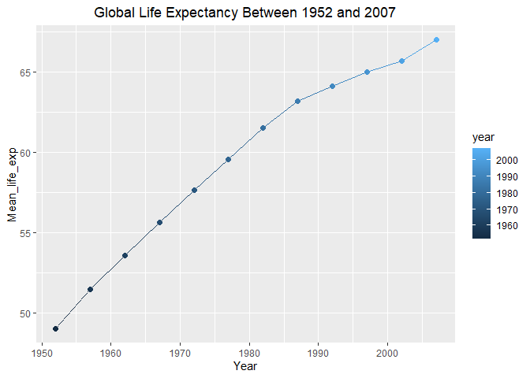
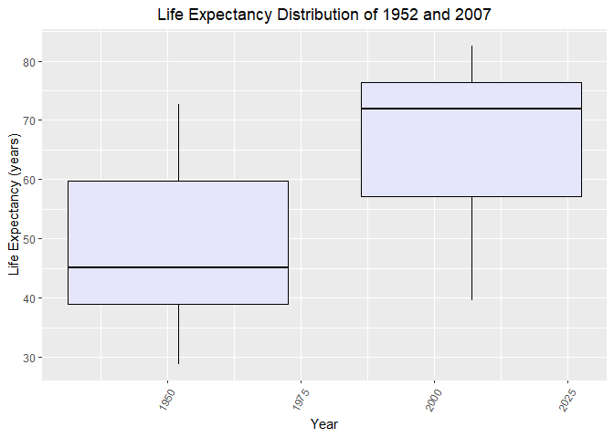
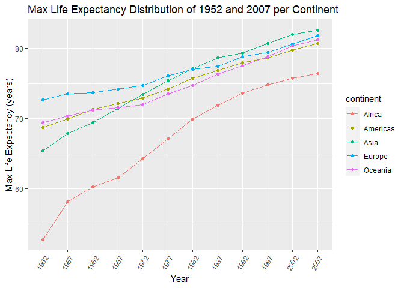
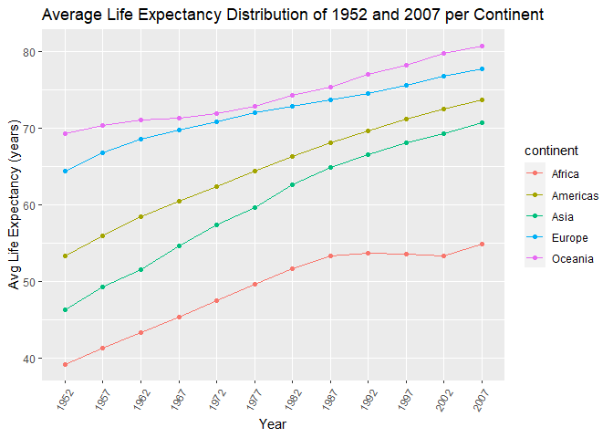
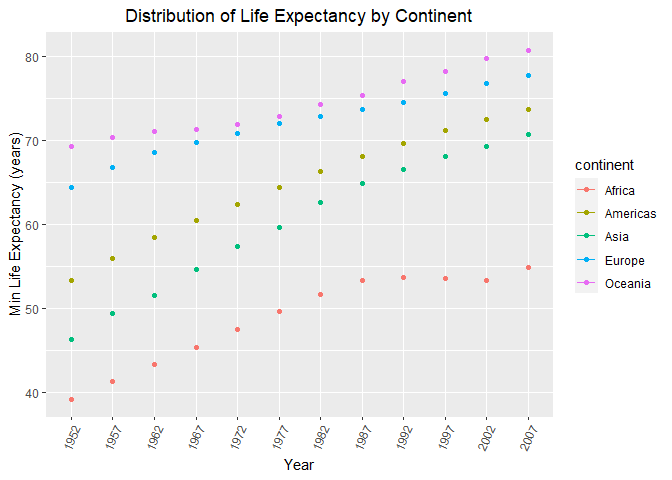
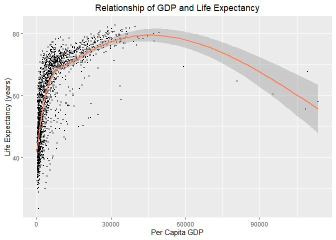
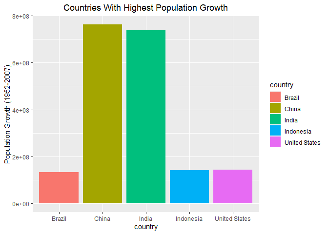
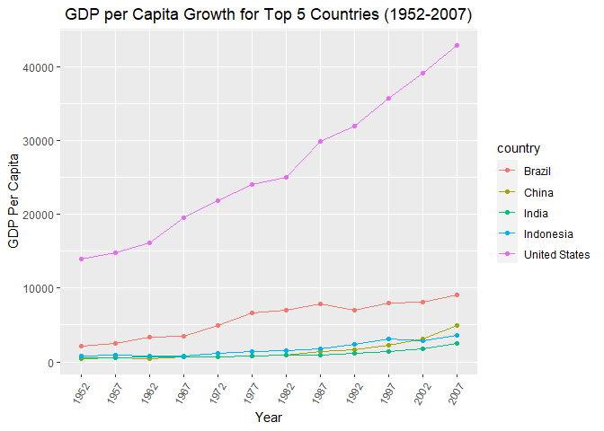
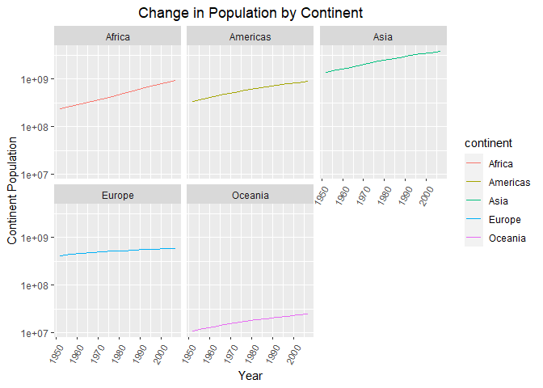

## Instructions
Answer the following questions and complete the exercises in RMarkdown. Please embed all of your code and push your final work to your repository. Your final lab report should be organized, clean, and run free from errors. Remember, you must remove the `#` for the included code chunks to run. Be sure to add your name to the author header above. For any included plots, make sure they are clearly labeled. You are free to use any plot type that you feel best communicates the results of your analysis.  

**In this homework, you should make use of the aesthetics you have learned. It's OK to be flashy!**

Make sure to use the formatting conventions of RMarkdown to make your report neat and clean!  

## Load the libraries

```r
library(tidyverse)
library(janitor)
library(here)
library(naniar)
```

## Resources
The idea for this assignment came from [Rebecca Barter's](http://www.rebeccabarter.com/blog/2017-11-17-ggplot2_tutorial/) ggplot tutorial so if you get stuck this is a good place to have a look.  

## Gapminder
For this assignment, we are going to use the dataset [gapminder](https://cran.r-project.org/web/packages/gapminder/index.html). Gapminder includes information about economics, population, and life expectancy from countries all over the world. You will need to install it before use. This is the same data that we will use for midterm 2 so this is good practice.

```r
#install.packages("gapminder")
library("gapminder")
```

## Questions
The questions below are open-ended and have many possible solutions. Your approach should, where appropriate, include numerical summaries and visuals. Be creative; assume you are building an analysis that you would ultimately present to an audience of stakeholders. Feel free to try out different `geoms` if they more clearly present your results.  

**1. Use the function(s) of your choice to get an idea of the overall structure of the data frame, including its dimensions, column names, variable classes, etc. As part of this, determine how NA's are treated in the data.**  


```r
gapminder <- gapminder%>%clean_names()
```


```r
naniar::miss_var_summary(gapminder) #check for NAs
```

```
## # A tibble: 6 x 3
##   variable   n_miss pct_miss
##   <chr>       <int>    <dbl>
## 1 country         0        0
## 2 continent       0        0
## 3 year            0        0
## 4 life_exp        0        0
## 5 pop             0        0
## 6 gdp_percap      0        0
```


```r
names(gapminder)
```

```
## [1] "country"    "continent"  "year"       "life_exp"   "pop"       
## [6] "gdp_percap"
```


```r
summary(gapminder)
```

```
##         country        continent        year         life_exp    
##  Afghanistan:  12   Africa  :624   Min.   :1952   Min.   :23.60  
##  Albania    :  12   Americas:300   1st Qu.:1966   1st Qu.:48.20  
##  Algeria    :  12   Asia    :396   Median :1980   Median :60.71  
##  Angola     :  12   Europe  :360   Mean   :1980   Mean   :59.47  
##  Argentina  :  12   Oceania : 24   3rd Qu.:1993   3rd Qu.:70.85  
##  Australia  :  12                  Max.   :2007   Max.   :82.60  
##  (Other)    :1632                                                
##       pop              gdp_percap      
##  Min.   :6.001e+04   Min.   :   241.2  
##  1st Qu.:2.794e+06   1st Qu.:  1202.1  
##  Median :7.024e+06   Median :  3531.8  
##  Mean   :2.960e+07   Mean   :  7215.3  
##  3rd Qu.:1.959e+07   3rd Qu.:  9325.5  
##  Max.   :1.319e+09   Max.   :113523.1  
## 
```

**2. Among the interesting variables in gapminder is life expectancy. How has global life expectancy changed between 1952 and 2007?**


```r
gapminder %>%
  group_by(year) %>%
  summarise(mean_life_exp=mean(life_exp)) %>%
  ggplot(aes(x=year, y=mean_life_exp, color=year))+
  geom_point(size=2)+
  theme(plot.title=element_text(hjust=0.5)) +
  labs(title="Global Life Expectancy Between 1952 and 2007",
       x="Year",
       y="Mean_life_exp")+
  theme(plot.title=element_text(hjust=0.5))+
  geom_line()
```

<!-- -->

Between 1952 and 2007, the global life expectancy has gradually increased over the years.

**3. How do the distributions of life expectancy compare for the years 1952 and 2007?**

```r
gapminder%>%
  select(year, life_exp)%>%
  filter(year %in% c("1952", "2007"))%>%
  group_by(year)%>%
  arrange(year)
```

```
## # A tibble: 284 x 2
## # Groups:   year [2]
##     year life_exp
##    <int>    <dbl>
##  1  1952     28.8
##  2  1952     55.2
##  3  1952     43.1
##  4  1952     30.0
##  5  1952     62.5
##  6  1952     69.1
##  7  1952     66.8
##  8  1952     50.9
##  9  1952     37.5
## 10  1952     68  
## # ... with 274 more rows
```


```r
gapminder %>%
   filter(year==1952|year==2007)%>%
 ggplot(aes(x=year, y=life_exp, group=year, ))+
  geom_boxplot(color="black", fill="lavender")+
  theme(axis.text.x=element_text(angle=60, hjust=1))+
  labs(title="Life Expectancy Distribution of 1952 and 2007", x="Year", y="Life Expectancy (years)")+
  theme(plot.title=element_text(hjust=0.5))
```

<!-- -->

There's a lower life expectancy in 1952 than there is in 2007.

**4. Your answer above doesn't tell the whole story since life expectancy varies by region. Make a summary that shows the min, mean, and max life expectancy by continent for all years represented in the data.**

```r
summary_gapminder<-gapminder%>%
  select(continent, life_exp, year)%>%
  group_by(continent, year)%>%
  summarise(min_life_exp=(min(life_exp)), mean_life_exp=mean(life_exp),max_life_exp=(max(life_exp)))
```

```
## `summarise()` has grouped output by 'continent'. You can override using the `.groups` argument.
```
**Max Life**

```r
summary_gapminder%>%
ggplot(aes(x=as.factor(year), y=max_life_exp, group=continent, color=continent))+geom_line()+geom_point()+theme(axis.text.x=element_text(angle=60, hjust=1))+labs(title="Max Life Expectancy Distribution of 1952 and 2007 per Continent", x="Year", y="Max Life Expectancy (years)")
```

<!-- -->

**Min Life**

```r
summary_gapminder%>%
ggplot(aes(x=as.factor(year), y=mean_life_exp, group=continent, color=continent))+geom_line()+geom_point()+theme(axis.text.x=element_text(angle=60, hjust=1))+labs(title="Min Life Expectancy Distribution of 1952 and 2007 per Continent", x="Year", y="Min Life Expectancy (years)")
```

<!-- -->

**Mean Life**

```r
summary_gapminder%>%
ggplot(aes(x=as.factor(year), y=mean_life_exp, group=continent, color=continent))+geom_line()+geom_point()+theme(axis.text.x=element_text(angle=60, hjust=1))+labs(title="Average Life Expectancy Distribution of 1952 and 2007 per Continent", x="Year", y="Avg Life Expectancy (years)")
```

<!-- -->

**5. How has life expectancy changed between 1952-2007 for each continent?**

```r
gapminder %>%
  group_by(continent, year) %>%
  summarise(mean_life_exp=mean(life_exp)) %>%
  ggplot(aes(x=as.factor(year), y=mean_life_exp, color=continent))+geom_line()+
  geom_point()+theme(axis.text.x=element_text(angle=65, hjust=1))+labs(title="Distribution of Life Expectancy by Continent", x="Year", y="Min Life Expectancy (years)")+
  theme(plot.title=element_text(hjust=0.5))
```

```
## `summarise()` has grouped output by 'continent'. You can override using the `.groups` argument.
```

```
## geom_path: Each group consists of only one observation. Do you need to adjust
## the group aesthetic?
```

<!-- -->

**6. We are interested in the relationship between per capita GDP and life expectancy; i.e. does having more money help you live longer?**

```r
gapminder %>% 
  ggplot(aes(x=gdp_percap, y=life_exp))+
  geom_point(size=0.5, position="jitter")+
  geom_smooth(color="coral")+
  labs(title="Relationship of GDP and Life Expectancy",
       x="Per Capita GDP",
       y="Life Expectancy (years)")+
  theme(plot.title=element_text(hjust=0.5))
```

```
## `geom_smooth()` using method = 'gam' and formula 'y ~ s(x, bs = "cs")'
```

<!-- -->

Here, we can see that as GDP increases, the Life expectancy starts to increase as well. However, it's clear that once you get to around 40,000 per capita GDP- life expectancy levels off and decreases. It's possible that there may be more challenges that interfere with an individual's life expectancy *(ie. external issues in working conditions as an example).*

**7. Which countries have had the largest population growth since 1952?**

```r
top_pop_growth<- gapminder %>% 
  select(country, year, pop) %>% 
  filter(year==1952 | year==2007) %>%
  pivot_wider(names_from = year,
              names_prefix = "year_",
              values_from = pop) %>%
  mutate(difference=year_2007-year_1952) %>%
  arrange(desc(difference))
top_pop_growth
```

```
## # A tibble: 142 x 4
##    country       year_1952  year_2007 difference
##    <fct>             <int>      <int>      <int>
##  1 China         556263527 1318683096  762419569
##  2 India         372000000 1110396331  738396331
##  3 United States 157553000  301139947  143586947
##  4 Indonesia      82052000  223547000  141495000
##  5 Brazil         56602560  190010647  133408087
##  6 Pakistan       41346560  169270617  127924057
##  7 Bangladesh     46886859  150448339  103561480
##  8 Nigeria        33119096  135031164  101912068
##  9 Mexico         30144317  108700891   78556574
## 10 Philippines    22438691   91077287   68638596
## # ... with 132 more rows
```

United States, India, and China have the largest population growth since 1952.

**8. Use your results from the question above to plot population growth for the top five countries since 1952.**

```r
top_pop_growth %>%
  top_n(5) %>%
  ggplot(aes(x=country, y=difference, fill=country))+
  geom_col()+
  labs(title="Countries With Highest Population Growth",
       y="Population Growth (1952-2007)")+
  theme(plot.title=element_text(hjust=0.5))
```

```
## Selecting by difference
```

<!-- -->

**9. How does per-capita GDP growth compare between these same five countries?**

```r
gapminder%>%
  filter(country %in% c("China", "India", "United States", "Indonesia", "Brazil"))%>%
  ggplot(aes(x=as.factor(year), y=gdp_percap, group=country, color=country))+geom_point()+geom_line()+theme(axis.text.x=element_text(angle=60, hjust=1))+labs(title="GDP per Capita Growth for Top 5 Countries (1952-2007)", x="Year", y="GDP Per Capita")+
theme(plot.title=element_text(hjust=0.5))
```

<!-- -->

**10. Make one plot of your choice that uses faceting!**

**In this case, I'm interested in finding each continent's population over time.**


```r
continent_pop <- gapminder %>% 
  select(continent, year, pop) %>% 
  group_by(continent, year) %>% 
  summarize(cont_pop=sum(pop)) %>% 
  print()
```

```
## `summarise()` has grouped output by 'continent'. You can override using the `.groups` argument.
```

```
## # A tibble: 60 x 3
## # Groups:   continent [5]
##    continent  year  cont_pop
##    <fct>     <int>     <dbl>
##  1 Africa     1952 237640501
##  2 Africa     1957 264837738
##  3 Africa     1962 296516865
##  4 Africa     1967 335289489
##  5 Africa     1972 379879541
##  6 Africa     1977 433061021
##  7 Africa     1982 499348587
##  8 Africa     1987 574834110
##  9 Africa     1992 659081517
## 10 Africa     1997 743832984
## # ... with 50 more rows
```


```r
continent_pop %>% 
  ggplot(aes(x=year, y=cont_pop, color=continent))+
  geom_line()+
  facet_wrap(~continent)+
  labs(title="Change in Population by Continent",
       x="Year",
       y="Continent Population")+
  scale_y_log10()+
  theme(axis.text.x = element_text(angle = 60, hjust = 1))+
  theme(plot.title=element_text(hjust=0.5))
```

<!-- -->

## Push your final code to GitHub!
Please be sure that you check the `keep md` file in the knit preferences. 
