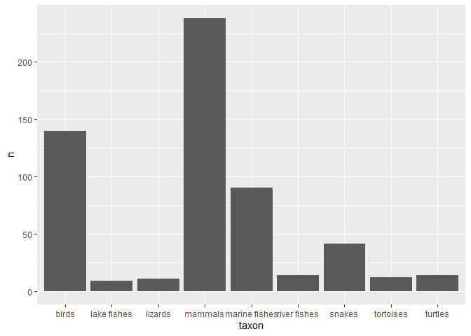

## Instructions
Answer the following questions and complete the exercises in RMarkdown. Please embed all of your code and push your final work to your repository. Your final lab report should be organized, clean, and run free from errors. Remember, you must remove the `#` for the included code chunks to run. Be sure to add your name to the author header above.  

Make sure to use the formatting conventions of RMarkdown to make your report neat and clean!  

## Load the tidyverse

```r
library(tidyverse)
```

## Data
For the homework, we will use data about vertebrate home range sizes. The data are in the class folder, but the reference is below.  

**Database of vertebrate home range sizes.**  
Reference: Tamburello N, Cote IM, Dulvy NK (2015) Energy and the scaling of animal space use. The American Naturalist 186(2):196-211. http://dx.doi.org/10.1086/682070.  
Data: http://datadryad.org/resource/doi:10.5061/dryad.q5j65/1  


```r
library("janitor")
```

```
## 
## Attaching package: 'janitor'
```

```
## The following objects are masked from 'package:stats':
## 
##     chisq.test, fisher.test
```


**1. Load the data into a new object called `homerange`.**

```r
homerange <- readr::read_csv("data/Tamburelloetal_HomeRangeDatabase.csv")
```

```
## Rows: 569 Columns: 24
```

```
## -- Column specification --------------------------------------------------------
## Delimiter: ","
## chr (16): taxon, common.name, class, order, family, genus, species, primarym...
## dbl  (8): mean.mass.g, log10.mass, mean.hra.m2, log10.hra, dimension, preyma...
```

```
## 
## i Use `spec()` to retrieve the full column specification for this data.
## i Specify the column types or set `show_col_types = FALSE` to quiet this message.
```

**2. Explore the data. Show the dimensions, column names, classes for each variable, and a statistical summary. Keep these as separate code chunks.**  

```r
dim(homerange) #dimensions
```

```
## [1] 569  24
```

```r
colnames(homerange)
```

```
##  [1] "taxon"                      "common.name"               
##  [3] "class"                      "order"                     
##  [5] "family"                     "genus"                     
##  [7] "species"                    "primarymethod"             
##  [9] "N"                          "mean.mass.g"               
## [11] "log10.mass"                 "alternative.mass.reference"
## [13] "mean.hra.m2"                "log10.hra"                 
## [15] "hra.reference"              "realm"                     
## [17] "thermoregulation"           "locomotion"                
## [19] "trophic.guild"              "dimension"                 
## [21] "preymass"                   "log10.preymass"            
## [23] "PPMR"                       "prey.size.reference"
```


```r
summary(homerange)
```

```
##     taxon           common.name           class              order          
##  Length:569         Length:569         Length:569         Length:569        
##  Class :character   Class :character   Class :character   Class :character  
##  Mode  :character   Mode  :character   Mode  :character   Mode  :character  
##                                                                             
##                                                                             
##                                                                             
##                                                                             
##     family             genus             species          primarymethod     
##  Length:569         Length:569         Length:569         Length:569        
##  Class :character   Class :character   Class :character   Class :character  
##  Mode  :character   Mode  :character   Mode  :character   Mode  :character  
##                                                                             
##                                                                             
##                                                                             
##                                                                             
##       N              mean.mass.g        log10.mass     
##  Length:569         Min.   :      0   Min.   :-0.6576  
##  Class :character   1st Qu.:     50   1st Qu.: 1.6990  
##  Mode  :character   Median :    330   Median : 2.5185  
##                     Mean   :  34602   Mean   : 2.5947  
##                     3rd Qu.:   2150   3rd Qu.: 3.3324  
##                     Max.   :4000000   Max.   : 6.6021  
##                                                        
##  alternative.mass.reference  mean.hra.m2          log10.hra     
##  Length:569                 Min.   :0.000e+00   Min.   :-1.523  
##  Class :character           1st Qu.:4.500e+03   1st Qu.: 3.653  
##  Mode  :character           Median :3.934e+04   Median : 4.595  
##                             Mean   :2.146e+07   Mean   : 4.709  
##                             3rd Qu.:1.038e+06   3rd Qu.: 6.016  
##                             Max.   :3.551e+09   Max.   : 9.550  
##                                                                 
##  hra.reference         realm           thermoregulation    locomotion       
##  Length:569         Length:569         Length:569         Length:569        
##  Class :character   Class :character   Class :character   Class :character  
##  Mode  :character   Mode  :character   Mode  :character   Mode  :character  
##                                                                             
##                                                                             
##                                                                             
##                                                                             
##  trophic.guild        dimension        preymass         log10.preymass   
##  Length:569         Min.   :2.000   Min.   :     0.67   Min.   :-0.1739  
##  Class :character   1st Qu.:2.000   1st Qu.:    20.02   1st Qu.: 1.3014  
##  Mode  :character   Median :2.000   Median :    53.75   Median : 1.7304  
##                     Mean   :2.218   Mean   :  3989.88   Mean   : 2.0188  
##                     3rd Qu.:2.000   3rd Qu.:   363.35   3rd Qu.: 2.5603  
##                     Max.   :3.000   Max.   :130233.20   Max.   : 5.1147  
##                                     NA's   :502         NA's   :502      
##       PPMR         prey.size.reference
##  Min.   :  0.380   Length:569         
##  1st Qu.:  3.315   Class :character   
##  Median :  7.190   Mode  :character   
##  Mean   : 31.752                      
##  3rd Qu.: 15.966                      
##  Max.   :530.000                      
##  NA's   :502
```


```r
glimpse(homerange)
```

```
## Rows: 569
## Columns: 24
## $ taxon                      <chr> "lake fishes", "river fishes", "river fishe~
## $ common.name                <chr> "american eel", "blacktail redhorse", "cent~
## $ class                      <chr> "actinopterygii", "actinopterygii", "actino~
## $ order                      <chr> "anguilliformes", "cypriniformes", "cyprini~
## $ family                     <chr> "anguillidae", "catostomidae", "cyprinidae"~
## $ genus                      <chr> "anguilla", "moxostoma", "campostoma", "cli~
## $ species                    <chr> "rostrata", "poecilura", "anomalum", "fundu~
## $ primarymethod              <chr> "telemetry", "mark-recapture", "mark-recapt~
## $ N                          <chr> "16", NA, "20", "26", "17", "5", "2", "2", ~
## $ mean.mass.g                <dbl> 887.00, 562.00, 34.00, 4.00, 4.00, 3525.00,~
## $ log10.mass                 <dbl> 2.9479236, 2.7497363, 1.5314789, 0.6020600,~
## $ alternative.mass.reference <chr> NA, NA, NA, NA, NA, NA, NA, NA, NA, NA, NA,~
## $ mean.hra.m2                <dbl> 282750.00, 282.10, 116.11, 125.50, 87.10, 3~
## $ log10.hra                  <dbl> 5.4514026, 2.4504031, 2.0648696, 2.0986437,~
## $ hra.reference              <chr> "Minns, C. K. 1995. Allometry of home range~
## $ realm                      <chr> "aquatic", "aquatic", "aquatic", "aquatic",~
## $ thermoregulation           <chr> "ectotherm", "ectotherm", "ectotherm", "ect~
## $ locomotion                 <chr> "swimming", "swimming", "swimming", "swimmi~
## $ trophic.guild              <chr> "carnivore", "carnivore", "carnivore", "car~
## $ dimension                  <dbl> 3, 2, 2, 2, 2, 2, 2, 2, 2, 2, 2, 2, 2, 3, 3~
## $ preymass                   <dbl> NA, NA, NA, NA, NA, NA, 1.39, NA, NA, NA, N~
## $ log10.preymass             <dbl> NA, NA, NA, NA, NA, NA, 0.1430148, NA, NA, ~
## $ PPMR                       <dbl> NA, NA, NA, NA, NA, NA, 530, NA, NA, NA, NA~
## $ prey.size.reference        <chr> NA, NA, NA, NA, NA, NA, "Brose U, et al. 20~
```

**3. Change the class of the variables `taxon` and `order` to factors and display their levels.**  


```r
homerange$taxon <- as.factor(homerange$taxon)
```


```r
levels(homerange$taxon) #print levels
```

```
## [1] "birds"         "lake fishes"   "lizards"       "mammals"      
## [5] "marine fishes" "river fishes"  "snakes"        "tortoises"    
## [9] "turtles"
```


```r
homerange$order <- as.factor(homerange$order)
```


```r
levels(homerange$order) #print levels
```

```
##  [1] "accipitriformes"    "afrosoricida"       "anguilliformes"    
##  [4] "anseriformes"       "apterygiformes"     "artiodactyla"      
##  [7] "caprimulgiformes"   "carnivora"          "charadriiformes"   
## [10] "columbidormes"      "columbiformes"      "coraciiformes"     
## [13] "cuculiformes"       "cypriniformes"      "dasyuromorpha"     
## [16] "dasyuromorpia"      "didelphimorphia"    "diprodontia"       
## [19] "diprotodontia"      "erinaceomorpha"     "esociformes"       
## [22] "falconiformes"      "gadiformes"         "galliformes"       
## [25] "gruiformes"         "lagomorpha"         "macroscelidea"     
## [28] "monotrematae"       "passeriformes"      "pelecaniformes"    
## [31] "peramelemorphia"    "perciformes"        "perissodactyla"    
## [34] "piciformes"         "pilosa"             "proboscidea"       
## [37] "psittaciformes"     "rheiformes"         "roden"             
## [40] "rodentia"           "salmoniformes"      "scorpaeniformes"   
## [43] "siluriformes"       "soricomorpha"       "squamata"          
## [46] "strigiformes"       "struthioniformes"   "syngnathiformes"   
## [49] "testudines"         "tetraodontiformes<U+00A0>" "tinamiformes"
```

**4. What taxa are represented in the `homerange` data frame? Make a new data frame `taxa` that is restricted to taxon, common name, class, order, family, genus, species.**  


```r
names(homerange)
```

```
##  [1] "taxon"                      "common.name"               
##  [3] "class"                      "order"                     
##  [5] "family"                     "genus"                     
##  [7] "species"                    "primarymethod"             
##  [9] "N"                          "mean.mass.g"               
## [11] "log10.mass"                 "alternative.mass.reference"
## [13] "mean.hra.m2"                "log10.hra"                 
## [15] "hra.reference"              "realm"                     
## [17] "thermoregulation"           "locomotion"                
## [19] "trophic.guild"              "dimension"                 
## [21] "preymass"                   "log10.preymass"            
## [23] "PPMR"                       "prey.size.reference"
```


```r
homerange <- clean_names(homerange)
homerange
```

```
## # A tibble: 569 x 24
##    taxon  common_name   class   order   family genus species primarymethod n    
##    <fct>  <chr>         <chr>   <fct>   <chr>  <chr> <chr>   <chr>         <chr>
##  1 lake ~ american eel  actino~ anguil~ angui~ angu~ rostra~ telemetry     16   
##  2 river~ blacktail re~ actino~ cyprin~ catos~ moxo~ poecil~ mark-recaptu~ <NA> 
##  3 river~ central ston~ actino~ cyprin~ cypri~ camp~ anomal~ mark-recaptu~ 20   
##  4 river~ rosyside dace actino~ cyprin~ cypri~ clin~ fundul~ mark-recaptu~ 26   
##  5 river~ longnose dace actino~ cyprin~ cypri~ rhin~ catara~ mark-recaptu~ 17   
##  6 river~ muskellunge   actino~ esocif~ esoci~ esox  masqui~ telemetry     5    
##  7 marin~ pollack       actino~ gadifo~ gadid~ poll~ pollac~ telemetry     2    
##  8 marin~ saithe        actino~ gadifo~ gadid~ poll~ virens  telemetry     2    
##  9 marin~ lined surgeo~ actino~ percif~ acant~ acan~ lineat~ direct obser~ <NA> 
## 10 marin~ orangespine ~ actino~ percif~ acant~ naso  litura~ telemetry     8    
## # ... with 559 more rows, and 15 more variables: mean_mass_g <dbl>,
## #   log10_mass <dbl>, alternative_mass_reference <chr>, mean_hra_m2 <dbl>,
## #   log10_hra <dbl>, hra_reference <chr>, realm <chr>, thermoregulation <chr>,
## #   locomotion <chr>, trophic_guild <chr>, dimension <dbl>, preymass <dbl>,
## #   log10_preymass <dbl>, ppmr <dbl>, prey_size_reference <chr>
```


```r
taxa <-select(homerange, taxon, common_name, class, order, family, genus, species)
names(taxa)
```

```
## [1] "taxon"       "common_name" "class"       "order"       "family"     
## [6] "genus"       "species"
```


**5. The variable `taxon` identifies the large, common name groups of the species represented in `homerange`. Make a table the shows the counts for each of these `taxon`.**  

```r
table(homerange$taxon)
```

```
## 
##         birds   lake fishes       lizards       mammals marine fishes 
##           140             9            11           238            90 
##  river fishes        snakes     tortoises       turtles 
##            14            41            12            14
```

```r
homerange %>% 
  group_by(taxon) %>% 
  count() %>% 
  ggplot(aes(x=taxon, y=n))+
  geom_col()
```

<!-- -->


**6. The species in `homerange` are also classified into trophic guilds. How many species are represented in each trophic guild.**  


```r
tabyl(homerange, trophic_guild)
```

```
##  trophic_guild   n   percent
##      carnivore 342 0.6010545
##      herbivore 227 0.3989455
```

There are 342 carnivores and 227 herbivores.

**7. Make two new data frames, one which is restricted to carnivores and another that is restricted to herbivores.** 

```r
carnivores <-filter(homerange, trophic_guild=="carnivore")
herbivores <-filter(homerange, trophic_guild=="herbivore" )
```


**8. Do herbivores or carnivores have, on average, a larger `mean.hra.m2`? Remove any NAs from the data.**  

```r
mean(herbivores$mean_hra_m2,na.rm=T)
```

```
## [1] 34137012
```


```r
mean(carnivores$mean_hra_m2,na.rm=T)
```

```
## [1] 13039918
```
Herbivores have on average, a larger mean_hra_m2.

**9. Make a new dataframe `deer` that is limited to the mean mass, log10 mass, family, genus, and species of deer in the database. The family for deer is cervidae. Arrange the data in descending order by log10 mass. Which is the largest deer? What is its common name?**  

```r
names(homerange)
```

```
##  [1] "taxon"                      "common_name"               
##  [3] "class"                      "order"                     
##  [5] "family"                     "genus"                     
##  [7] "species"                    "primarymethod"             
##  [9] "n"                          "mean_mass_g"               
## [11] "log10_mass"                 "alternative_mass_reference"
## [13] "mean_hra_m2"                "log10_hra"                 
## [15] "hra_reference"              "realm"                     
## [17] "thermoregulation"           "locomotion"                
## [19] "trophic_guild"              "dimension"                 
## [21] "preymass"                   "log10_preymass"            
## [23] "ppmr"                       "prey_size_reference"
```


```r
deer <- select(homerange,mean_mass_g, log10_mass, family, genus, species)
```


```r
deer_final <- filter(deer,family=="cervidae")
deer_final
```

```
## # A tibble: 12 x 5
##    mean_mass_g log10_mass family   genus      species    
##          <dbl>      <dbl> <chr>    <chr>      <chr>      
##  1     307227.       5.49 cervidae alces      alces      
##  2      62823.       4.80 cervidae axis       axis       
##  3      24050.       4.38 cervidae capreolus  capreolus  
##  4     234758.       5.37 cervidae cervus     elaphus    
##  5      29450.       4.47 cervidae cervus     nippon     
##  6      71450.       4.85 cervidae dama       dama       
##  7      13500.       4.13 cervidae muntiacus  reevesi    
##  8      53864.       4.73 cervidae odocoileus hemionus   
##  9      87884.       4.94 cervidae odocoileus virginianus
## 10      35000.       4.54 cervidae ozotoceros bezoarticus
## 11       7500.       3.88 cervidae pudu       puda       
## 12     102059.       5.01 cervidae rangifer   tarandus
```


```r
arrange(deer_final, desc(log10_mass))
```

```
## # A tibble: 12 x 5
##    mean_mass_g log10_mass family   genus      species    
##          <dbl>      <dbl> <chr>    <chr>      <chr>      
##  1     307227.       5.49 cervidae alces      alces      
##  2     234758.       5.37 cervidae cervus     elaphus    
##  3     102059.       5.01 cervidae rangifer   tarandus   
##  4      87884.       4.94 cervidae odocoileus virginianus
##  5      71450.       4.85 cervidae dama       dama       
##  6      62823.       4.80 cervidae axis       axis       
##  7      53864.       4.73 cervidae odocoileus hemionus   
##  8      35000.       4.54 cervidae ozotoceros bezoarticus
##  9      29450.       4.47 cervidae cervus     nippon     
## 10      24050.       4.38 cervidae capreolus  capreolus  
## 11      13500.       4.13 cervidae muntiacus  reevesi    
## 12       7500.       3.88 cervidae pudu       puda
```


```r
max_deer_weight <- max(deer_final$mean_mass_g)
max_deer_weight #largest deer
```

```
## [1] 307227.4
```
The largest deer is the species "alces" which translates to its common name as a moose! 

**10. As measured by the data, which snake species has the smallest homerange? Show all of your work, please. Look this species up online and tell me about it!** **Snake is found in taxon column**    

```r
snakes <- filter(homerange, taxon == "snakes") #filtering homerange so that there's only snake data
snakes <- select(snakes, "common_name", "genus", "species","mean_hra_m2")
```


```r
arrange(snakes, mean_hra_m2)
```

```
## # A tibble: 41 x 4
##    common_name          genus       species      mean_hra_m2
##    <chr>                <chr>       <chr>              <dbl>
##  1 namaqua dwarf adder  bitis       schneideri          200 
##  2 eastern worm snake   carphopis   viridis             253 
##  3 butlers garter snake thamnophis  butleri             600 
##  4 western worm snake   carphopis   vermis              700 
##  5 snubnosed viper      vipera      latastei           2400 
##  6 chinese pit viper    gloydius    shedaoensis        2614.
##  7 ringneck snake       diadophis   punctatus          6476 
##  8 cottonmouth          agkistrodon piscivorous       10655 
##  9 redbacked ratsnake   oocatochus  rufodorsatus      15400 
## 10 gopher snake         pituophis   catenifer         17400 
## # ... with 31 more rows
```

The Namaqua Dwarf Adder has the smallest homerange of the species. It's a fascinating snake that can been found usually in Northern Cape as well as south-western part of Namibia which consists of coastal sand dunes. They tend to eat lizards, small mammals, and frogs/toads. This specie is considered the smallest adder and lives roughly for 10 years! 

## Push your final code to GitHub!
Please be sure that you check the `keep md` file in the knit preferences.   
