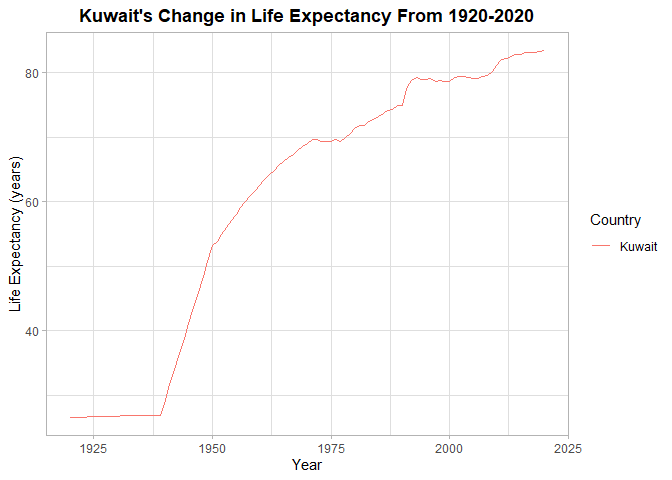
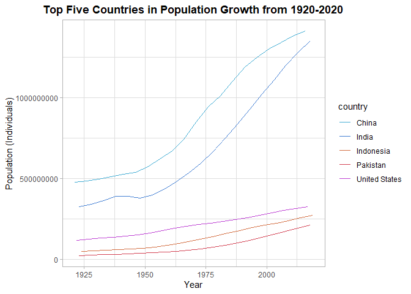
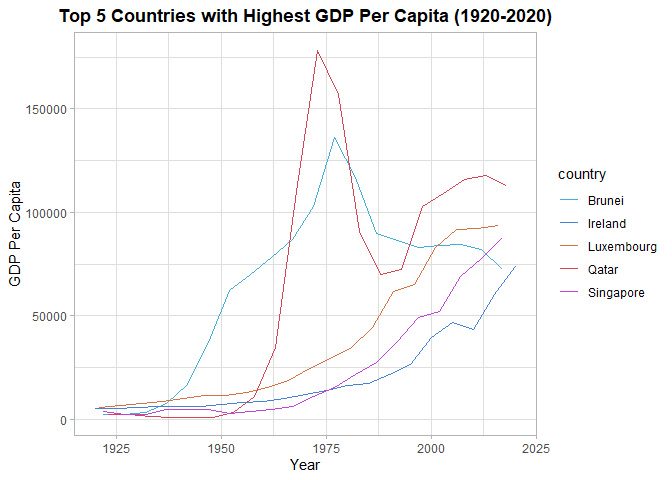
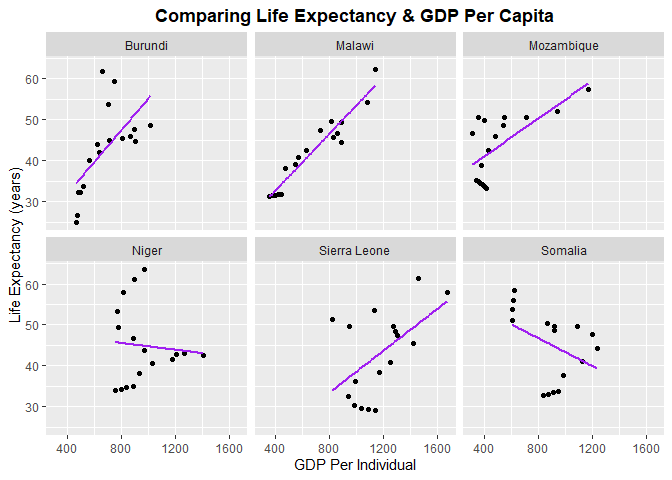

## Instructions
Answer the following questions and complete the exercises in RMarkdown. Please embed all of your code and push your final work to your repository. Your code should be organized, clean, and run free from errors. Be sure to **add your name** to the author header above. You may use any resources to answer these questions (including each other), but you may not post questions to Open Stacks or external help sites. There are 10 total questions.  

Make sure to use the formatting conventions of RMarkdown to make your report neat and clean! Your plots should use consistent aesthetics throughout.  

This exam is due by **12:00p on Tuesday, February 22**.  

## Gapminder
For this assignment, we are going to use data from  [gapminder](https://www.gapminder.org/). Gapminder includes information about economics, population, social issues, and life expectancy from countries all over the world. We will use three data sets, so please load all three as separate objects.  


```r
library("ggthemes")
```

```
## Warning in register(): Can't find generic `scale_type` in package ggplot2 to
## register S3 method.
```

```r
library("gapminder")
library("skimr")
library("tidyverse")
```

```
## -- Attaching packages --------------------------------------- tidyverse 1.3.1 --
```

```
## v ggplot2 3.3.5     v purrr   0.3.4
## v tibble  3.1.6     v dplyr   1.0.7
## v tidyr   1.1.4     v stringr 1.4.0
## v readr   2.1.1     v forcats 0.5.1
```

```
## -- Conflicts ------------------------------------------ tidyverse_conflicts() --
## x dplyr::filter() masks stats::filter()
## x dplyr::lag()    masks stats::lag()
```

```r
library("here")
```

```
## here() starts at C:/Users/carmi/Desktop/BIS15W2022_cinguito
```


1. population_total.csv  

```r
population_total <-readr::read_csv(here("midterm2", "data", "population_total.csv")) 
```

```
## Rows: 195 Columns: 302
```

```
## -- Column specification --------------------------------------------------------
## Delimiter: ","
## chr   (1): country
## dbl (301): 1800, 1801, 1802, 1803, 1804, 1805, 1806, 1807, 1808, 1809, 1810,...
```

```
## 
## i Use `spec()` to retrieve the full column specification for this data.
## i Specify the column types or set `show_col_types = FALSE` to quiet this message.
```

2. income_per_person_gdppercapita_ppp_inflation_adjusted.csv  

```r
income_per_person <-readr::read_csv(here("midterm2", "data", 
"income_per_person_gdppercapita_ppp_inflation_adjusted.csv"))
```

```
## Rows: 193 Columns: 242
```

```
## -- Column specification --------------------------------------------------------
## Delimiter: ","
## chr   (1): country
## dbl (241): 1800, 1801, 1802, 1803, 1804, 1805, 1806, 1807, 1808, 1809, 1810,...
```

```
## 
## i Use `spec()` to retrieve the full column specification for this data.
## i Specify the column types or set `show_col_types = FALSE` to quiet this message.
```

3. life_expectancy_years.csv  

```r
life_expectancy <- readr::read_csv(here("midterm2", "data", "life_expectancy_years.csv"))
```

```
## Rows: 187 Columns: 302
```

```
## -- Column specification --------------------------------------------------------
## Delimiter: ","
## chr   (1): country
## dbl (301): 1800, 1801, 1802, 1803, 1804, 1805, 1806, 1807, 1808, 1809, 1810,...
```

```
## 
## i Use `spec()` to retrieve the full column specification for this data.
## i Specify the column types or set `show_col_types = FALSE` to quiet this message.
```

**1. (3 points) Once you have an idea of the structure of the data, please make each data set tidy (hint: think back to pivots) and store them as new objects. You will need both the original (wide) and tidy (long) data!**

**Population Total**

```r
anyNA(population_total)
```

```
## [1] FALSE
```


```r
head(population_total)
```

```
## # A tibble: 6 x 302
##   country  `1800` `1801` `1802` `1803` `1804` `1805` `1806` `1807` `1808` `1809`
##   <chr>     <dbl>  <dbl>  <dbl>  <dbl>  <dbl>  <dbl>  <dbl>  <dbl>  <dbl>  <dbl>
## 1 Afghani~ 3.28e6 3.28e6 3.28e6 3.28e6 3.28e6 3.28e6 3.28e6 3.28e6 3.28e6 3.28e6
## 2 Albania  4   e5 4.02e5 4.04e5 4.05e5 4.07e5 4.09e5 4.11e5 4.13e5 4.14e5 4.16e5
## 3 Algeria  2.5 e6 2.51e6 2.52e6 2.53e6 2.54e6 2.55e6 2.56e6 2.56e6 2.57e6 2.58e6
## 4 Andorra  2.65e3 2.65e3 2.65e3 2.65e3 2.65e3 2.65e3 2.65e3 2.65e3 2.65e3 2.65e3
## 5 Angola   1.57e6 1.57e6 1.57e6 1.57e6 1.57e6 1.57e6 1.57e6 1.57e6 1.57e6 1.57e6
## 6 Antigua~ 3.7 e4 3.7 e4 3.7 e4 3.7 e4 3.7 e4 3.7 e4 3.7 e4 3.7 e4 3.7 e4 3.7 e4
## # ... with 291 more variables: `1810` <dbl>, `1811` <dbl>, `1812` <dbl>,
## #   `1813` <dbl>, `1814` <dbl>, `1815` <dbl>, `1816` <dbl>, `1817` <dbl>,
## #   `1818` <dbl>, `1819` <dbl>, `1820` <dbl>, `1821` <dbl>, `1822` <dbl>,
## #   `1823` <dbl>, `1824` <dbl>, `1825` <dbl>, `1826` <dbl>, `1827` <dbl>,
## #   `1828` <dbl>, `1829` <dbl>, `1830` <dbl>, `1831` <dbl>, `1832` <dbl>,
## #   `1833` <dbl>, `1834` <dbl>, `1835` <dbl>, `1836` <dbl>, `1837` <dbl>,
## #   `1838` <dbl>, `1839` <dbl>, `1840` <dbl>, `1841` <dbl>, `1842` <dbl>, ...
```


```r
long_population <- population_total %>%
  pivot_longer(-c(country),
               names_to="year",
               values_to="population")
long_population
```

```
## # A tibble: 58,695 x 3
##    country     year  population
##    <chr>       <chr>      <dbl>
##  1 Afghanistan 1800     3280000
##  2 Afghanistan 1801     3280000
##  3 Afghanistan 1802     3280000
##  4 Afghanistan 1803     3280000
##  5 Afghanistan 1804     3280000
##  6 Afghanistan 1805     3280000
##  7 Afghanistan 1806     3280000
##  8 Afghanistan 1807     3280000
##  9 Afghanistan 1808     3280000
## 10 Afghanistan 1809     3280000
## # ... with 58,685 more rows
```

**Income**

```r
anyNA(income_per_person)
```

```
## [1] FALSE
```


```r
head(income_per_person)
```

```
## # A tibble: 6 x 242
##   country  `1800` `1801` `1802` `1803` `1804` `1805` `1806` `1807` `1808` `1809`
##   <chr>     <dbl>  <dbl>  <dbl>  <dbl>  <dbl>  <dbl>  <dbl>  <dbl>  <dbl>  <dbl>
## 1 Afghani~    603    603    603    603    603    603    603    603    603    603
## 2 Albania     667    667    667    667    667    668    668    668    668    668
## 3 Algeria     715    716    717    718    719    720    721    722    723    724
## 4 Andorra    1200   1200   1200   1200   1210   1210   1210   1210   1220   1220
## 5 Angola      618    620    623    626    628    631    634    637    640    642
## 6 Antigua~    757    757    757    757    757    757    757    758    758    758
## # ... with 231 more variables: `1810` <dbl>, `1811` <dbl>, `1812` <dbl>,
## #   `1813` <dbl>, `1814` <dbl>, `1815` <dbl>, `1816` <dbl>, `1817` <dbl>,
## #   `1818` <dbl>, `1819` <dbl>, `1820` <dbl>, `1821` <dbl>, `1822` <dbl>,
## #   `1823` <dbl>, `1824` <dbl>, `1825` <dbl>, `1826` <dbl>, `1827` <dbl>,
## #   `1828` <dbl>, `1829` <dbl>, `1830` <dbl>, `1831` <dbl>, `1832` <dbl>,
## #   `1833` <dbl>, `1834` <dbl>, `1835` <dbl>, `1836` <dbl>, `1837` <dbl>,
## #   `1838` <dbl>, `1839` <dbl>, `1840` <dbl>, `1841` <dbl>, `1842` <dbl>, ...
```


```r
long_income <- income_per_person %>%
  pivot_longer(-c(country),
               names_to="year",
               values_to="gdp_per_capita")
long_income
```

```
## # A tibble: 46,513 x 3
##    country     year  gdp_per_capita
##    <chr>       <chr>          <dbl>
##  1 Afghanistan 1800             603
##  2 Afghanistan 1801             603
##  3 Afghanistan 1802             603
##  4 Afghanistan 1803             603
##  5 Afghanistan 1804             603
##  6 Afghanistan 1805             603
##  7 Afghanistan 1806             603
##  8 Afghanistan 1807             603
##  9 Afghanistan 1808             603
## 10 Afghanistan 1809             603
## # ... with 46,503 more rows
```

**Life Expectancy**

```r
anyNA(life_expectancy)
```

```
## [1] TRUE
```


```r
head(life_expectancy)
```

```
## # A tibble: 6 x 302
##   country  `1800` `1801` `1802` `1803` `1804` `1805` `1806` `1807` `1808` `1809`
##   <chr>     <dbl>  <dbl>  <dbl>  <dbl>  <dbl>  <dbl>  <dbl>  <dbl>  <dbl>  <dbl>
## 1 Afghani~   28.2   28.2   28.2   28.2   28.2   28.2   28.1   28.1   28.1   28.1
## 2 Albania    35.4   35.4   35.4   35.4   35.4   35.4   35.4   35.4   35.4   35.4
## 3 Algeria    28.8   28.8   28.8   28.8   28.8   28.8   28.8   28.8   28.8   28.8
## 4 Andorra    NA     NA     NA     NA     NA     NA     NA     NA     NA     NA  
## 5 Angola     27     27     27     27     27     27     27     27     27     27  
## 6 Antigua~   33.5   33.5   33.5   33.5   33.5   33.5   33.5   33.5   33.5   33.5
## # ... with 291 more variables: `1810` <dbl>, `1811` <dbl>, `1812` <dbl>,
## #   `1813` <dbl>, `1814` <dbl>, `1815` <dbl>, `1816` <dbl>, `1817` <dbl>,
## #   `1818` <dbl>, `1819` <dbl>, `1820` <dbl>, `1821` <dbl>, `1822` <dbl>,
## #   `1823` <dbl>, `1824` <dbl>, `1825` <dbl>, `1826` <dbl>, `1827` <dbl>,
## #   `1828` <dbl>, `1829` <dbl>, `1830` <dbl>, `1831` <dbl>, `1832` <dbl>,
## #   `1833` <dbl>, `1834` <dbl>, `1835` <dbl>, `1836` <dbl>, `1837` <dbl>,
## #   `1838` <dbl>, `1839` <dbl>, `1840` <dbl>, `1841` <dbl>, `1842` <dbl>, ...
```


```r
long_life_exp <- life_expectancy %>%
  pivot_longer(-c(country),
               names_to= "year",
               values_to= "life_expectancy")
long_life_exp
```

```
## # A tibble: 56,287 x 3
##    country     year  life_expectancy
##    <chr>       <chr>           <dbl>
##  1 Afghanistan 1800             28.2
##  2 Afghanistan 1801             28.2
##  3 Afghanistan 1802             28.2
##  4 Afghanistan 1803             28.2
##  5 Afghanistan 1804             28.2
##  6 Afghanistan 1805             28.2
##  7 Afghanistan 1806             28.1
##  8 Afghanistan 1807             28.1
##  9 Afghanistan 1808             28.1
## 10 Afghanistan 1809             28.1
## # ... with 56,277 more rows
```

**2. (1 point) How many different countries are represented in the data? Provide the total number and their names. Since each data set includes different numbers of countries, you will need to do this for each one.**  

**Population**

```r
long_population %>%
  summarise(n=n_distinct(country)) %>%
  summarise(country_count=sum(n))
```

```
## # A tibble: 1 x 1
##   country_count
##           <int>
## 1           195
```

```r
long_population %>%
  distinct(country)
```

```
## # A tibble: 195 x 1
##    country            
##    <chr>              
##  1 Afghanistan        
##  2 Albania            
##  3 Algeria            
##  4 Andorra            
##  5 Angola             
##  6 Antigua and Barbuda
##  7 Argentina          
##  8 Armenia            
##  9 Australia          
## 10 Austria            
## # ... with 185 more rows
```

There are 195 different countries represented in the data.

**Income**

```r
long_income %>%
  summarise(n=n_distinct(country)) %>%
  summarise(country_count=sum(n))
```

```
## # A tibble: 1 x 1
##   country_count
##           <int>
## 1           193
```


```r
long_income %>%
  distinct(country)
```

```
## # A tibble: 193 x 1
##    country            
##    <chr>              
##  1 Afghanistan        
##  2 Albania            
##  3 Algeria            
##  4 Andorra            
##  5 Angola             
##  6 Antigua and Barbuda
##  7 Argentina          
##  8 Armenia            
##  9 Australia          
## 10 Austria            
## # ... with 183 more rows
```
There are 193 distinct countries within the income per person data.

**Life Expectancy**

```r
long_life_exp %>%
  summarise(n=n_distinct(country)) %>%
  summarise(country_count=sum(n))
```

```
## # A tibble: 1 x 1
##   country_count
##           <int>
## 1           187
```


```r
long_life_exp %>%
  distinct(country)
```

```
## # A tibble: 187 x 1
##    country            
##    <chr>              
##  1 Afghanistan        
##  2 Albania            
##  3 Algeria            
##  4 Andorra            
##  5 Angola             
##  6 Antigua and Barbuda
##  7 Argentina          
##  8 Armenia            
##  9 Australia          
## 10 Austria            
## # ... with 177 more rows
```

There are 187 distinct countries within the life expectancy data.


```r
long_life_exp
```

```
## # A tibble: 56,287 x 3
##    country     year  life_expectancy
##    <chr>       <chr>           <dbl>
##  1 Afghanistan 1800             28.2
##  2 Afghanistan 1801             28.2
##  3 Afghanistan 1802             28.2
##  4 Afghanistan 1803             28.2
##  5 Afghanistan 1804             28.2
##  6 Afghanistan 1805             28.2
##  7 Afghanistan 1806             28.1
##  8 Afghanistan 1807             28.1
##  9 Afghanistan 1808             28.1
## 10 Afghanistan 1809             28.1
## # ... with 56,277 more rows
```


## Life Expectancy  

**3. (2 points) Let's limit the data to 100 years (1920-2020). For these years, which country has the highest average life expectancy? How about the lowest average life expectancy?** 

**Highest Average Life Expectancy** Andorra

```r
long_life_exp %>%
  filter(year <=2020 & year>=1920) %>% 
  group_by(country) %>%
  summarise(mean_life_expectancy=mean(life_expectancy, na.rm=T)) %>%
  arrange(desc(mean_life_expectancy)) %>%
  head(n=1)
```

```
## # A tibble: 1 x 2
##   country mean_life_expectancy
##   <chr>                  <dbl>
## 1 Andorra                 79.8
```

**Lowest Average Life Expectancy** Central African Republic

```r
long_life_exp %>%
  filter(year <=2020 & year>=1920) %>% 
  group_by(country) %>%
  summarise(mean_life_expectancy=mean(life_expectancy, na.rm=T)) %>%
  arrange(mean_life_expectancy) %>%
  head(n=1)
```

```
## # A tibble: 1 x 2
##   country                  mean_life_expectancy
##   <chr>                                   <dbl>
## 1 Central African Republic                 41.8
```

**4. (3 points) Although we can see which country has the highest life expectancy for the past 100 years, we don't know which countries have changed the most. What are the top 5 countries that have experienced the biggest improvement in life expectancy between 1920-2020?**  

```r
long_life_exp %>% 
  filter(year==1920 | year==2020) %>%
  group_by(country) %>%
  summarise(life_exp_change=(max(life_expectancy)-min(life_expectancy))) %>%
  arrange(desc(life_exp_change)) %>%
  head(5)
```

```
## # A tibble: 5 x 2
##   country         life_exp_change
##   <chr>                     <dbl>
## 1 Kuwait                     56.8
## 2 Kyrgyz Republic            56.5
## 3 Turkmenistan               55.3
## 4 South Korea                55  
## 5 Tajikistan                 54.3
```

The top five countries that have experienced the biggest improvement in life expectancy between 1920-2020 are Kuwait, Kyrgyz Republic, Turkmenistan, South Korea,and Tajikistan. 

**5. (3 points) Make a plot that shows the change over the past 100 years for the country with the biggest improvement in life expectancy. Be sure to add appropriate aesthetics to make the plot clean and clear. Once you have made the plot, do a little internet searching and see if you can discover what historical event may have contributed to this remarkable change.**


```r
long_life_exp %>%
  filter(country== "Kuwait",
         !is.na(life_expectancy), 
         between(year, 1920,2020)) %>%

ggplot(aes(x=as.numeric(year), y=life_expectancy, color=country))+
  geom_line() +
  labs(x="Year", 
       y="Life Expectancy (years)",
       title="Kuwait's Change in Life Expectancy From 1920-2020",
       color="Country") +
  theme_light()+
theme(plot.title=element_text(face="bold", hjust=0.5))
```

<!-- -->

As one can see from the created plot, Kuwait has greatly increased in life expectancy over a duration of 100 years. Around the 1930s, the Petroleum Industry was created which paved way for the expansion in the economy; thus, allowing the country to be more wealthier and have a greater longevity for those living in Kuwait. 

## Population Growth
**6. (3 points) Which 5 countries have had the highest population growth over the past 100 years (1920-2020)?**

```r
options(scipen=100) #did research here as I wasn't sure how to remove the scientific notation
long_population %>%
  filter(!is.na(population), year %in% c(1920,2020)) %>%
  group_by(country) %>%
  summarise(population_growth=(max(population)-min(population))) %>%
  arrange(desc(population_growth)) %>%
  head(5)
```

```
## # A tibble: 5 x 2
##   country       population_growth
##   <chr>                     <dbl>
## 1 India                1063000000
## 2 China                 968000000
## 3 Indonesia             226700000
## 4 United States         220000000
## 5 Pakistan              199300000
```

The top five countries with the highest population growth over the past 100 years are India, China, Indonesia,United States, and Pakistan. 

**7. (4 points) Produce a plot that shows the 5 countries that have had the highest population growth over the past 100 years (1920-2020). Which countries appear to have had exponential growth?**  

```r
palette <- c("#46AED4", "#4681D4", "#D47146", "#D44657",
          "#BF46D4") #interested in using different colors
```


```r
long_population %>%
  filter(year>=1920 & year<=2020) %>%
  filter(country==c("India", "China", "Indonesia", "United States", "Pakistan")) %>% 
  ggplot(aes(x=as.numeric(year), y=population, color=country))+
  geom_line(size=0.60)+
  labs(title= "Top Five Countries in Population Growth from 1920-2020",
       x= "Year",
       y= "Population (Individuals)")+
  theme_light()+
  scale_color_manual(values=palette)+
  theme(plot.title=element_text(face="bold",hjust=0.5))
```

<!-- -->

```r
long_population
```

```
## # A tibble: 58,695 x 3
##    country     year  population
##    <chr>       <chr>      <dbl>
##  1 Afghanistan 1800     3280000
##  2 Afghanistan 1801     3280000
##  3 Afghanistan 1802     3280000
##  4 Afghanistan 1803     3280000
##  5 Afghanistan 1804     3280000
##  6 Afghanistan 1805     3280000
##  7 Afghanistan 1806     3280000
##  8 Afghanistan 1807     3280000
##  9 Afghanistan 1808     3280000
## 10 Afghanistan 1809     3280000
## # ... with 58,685 more rows
```
The countries that appear to have exponential growth are **China and India.**

## Income
The units used for income are gross domestic product per person adjusted for differences in purchasing power in international dollars.

**8. (4 points) As in the previous questions, which countries have experienced the biggest growth in per person GDP. Show this as a table and then plot the changes for the top 5 countries. With a bit of research, you should be able to explain the dramatic downturns of the wealthiest economies that occurred during the 1980's.**  

**Note:** Change in GDP between countries- end/beginning year (doesn't account for good and bad years) subtract beginning and end? max/min? Results may differ depending on how you go about this. 


```r
years <- c(1920:2020)
colnames(long_income)
```

```
## [1] "country"        "year"           "gdp_per_capita"
```


```r
income_overtime <- long_income %>% 
  mutate(year = str_replace(year, "x", ""),
         year = as.numeric(year)) %>%
  filter(year %in% years) %>% 
  pivot_wider(names_from = "year", values_from = "gdp_per_capita") %>% 
  mutate(change = `2020` - `1920`) %>% 
  select(c(country, change)) %>% 
  arrange(desc(change)) 
```

*The top five countries are Qatar, Luxembourg, Brunei, Singapore, and Ireland. Here's how each of their income has changed over 100 years (1920-2020):*


```r
long_income %>%
filter(country==c("Ireland", "Brunei", "Qatar", "Singapore", "Luxembourg")) %>%
  filter(year >=1920, year <=2020) %>%
  ggplot(aes(x=as.numeric(year),y=gdp_per_capita, fill=country, color=country)) +
  geom_line(size=0.60)+
  scale_color_manual(values=palette)+
  labs(title= "Top 5 Countries with Highest GDP Per Capita (1920-2020)", x="Year", y="GDP Per Capita") +
  theme_light()+
  theme(plot.title=element_text(face="bold",hjust=0.5))
```

```
## Warning in country == c("Ireland", "Brunei", "Qatar", "Singapore",
## "Luxembourg"): longer object length is not a multiple of shorter object length
```

<!-- -->

During the 1980s, these wealthy economies had "dramatic downturns" because of the 1979 Oil Crisis as oil prices were decreasing internationally. Qatar, the most country that demonstrated the greatest decrease in GDP Per Capita in the plot, had its government's spending cut in order to help lower income. 

**9. (3 points) Create three new objects that restrict each data set (life expectancy, population, income) to the years 1920-2020. Hint: I suggest doing this with the long form of your data. Once this is done, merge all three data sets using the code I provide below. You may need to adjust the code depending on how you have named your objects. I called mine `life_expectancy_100`, `population_100`, and `income_100`. For some of you, learning these `joins` will be important for your project.**  

```r
life_expectancy_100 <- long_life_exp %>%
  filter(between(year, 1920, 2020))
```


```r
population_100 <- long_population %>%
  filter(between(year, 1920, 2020))
```


```r
income_100 <- long_income %>%
  filter(between(year, 1920, 2020))
```


```r
gapminder_join <- inner_join(life_expectancy_100, population_100, by= c("country", "year"))
gapminder_join <- inner_join(gapminder_join, income_100, by= c("country", "year"))
gapminder_join
```

```
## # A tibble: 18,887 x 5
##    country     year  life_expectancy population gdp_per_capita
##    <chr>       <chr>           <dbl>      <dbl>          <dbl>
##  1 Afghanistan 1920             30.6   10600000           1490
##  2 Afghanistan 1921             30.7   10500000           1520
##  3 Afghanistan 1922             30.8   10300000           1550
##  4 Afghanistan 1923             30.8    9710000           1570
##  5 Afghanistan 1924             30.9    9200000           1600
##  6 Afghanistan 1925             31      8720000           1630
##  7 Afghanistan 1926             31      8260000           1650
##  8 Afghanistan 1927             31.1    7830000           1680
##  9 Afghanistan 1928             31.1    7420000           1710
## 10 Afghanistan 1929             31.2    7100000           1740
## # ... with 18,877 more rows
```

**10. (4 points) Use the joined data to perform an analysis of your choice. The analysis should include a comparison between two or more of the variables `life_expectancy`, `population`, or `income.`**  

*I am interested in understanding the relationship between life_expectancy and income (GDP) between countries. If there's lower GDP, would that mean there's a decrease in life expectancy? What are alternative explanations as to why this may or may not be the case?*


```r
gapminder_join %>%
  group_by(country) %>%
  summarise(min=min(gdp_per_capita),
            max=max(gdp_per_capita)) %>%
  mutate(delta_income=max-min) %>%
  arrange(delta_income) %>%
  head(n=6)
```

```
## # A tibble: 6 x 4
##   country        min   max delta_income
##   <chr>        <dbl> <dbl>        <dbl>
## 1 Burundi        467  1050          583
## 2 Somalia        603  1290          687
## 3 Niger          735  1460          725
## 4 Malawi         356  1210          854
## 5 Sierra Leone   821  1710          889
## 6 Mozambique     312  1210          898
```
Plotting the Data Above: 

```r
gapminder_join %>%
  filter(country==c("Mozambique", "Sierra Leone", "Malawi", "Niger", "Somalia", "Burundi")) %>%
  ggplot(aes(x=as.numeric(gdp_per_capita), y=life_expectancy))+ geom_point(size=1.25)+
  geom_smooth(method="lm", se=FALSE, color="purple")+
  facet_wrap(.~country)+
  theme_gray()+
  labs(title= "Comparing Life Expectancy & GDP Per Capita",
       x="GDP Per Individual",
       y="Life Expectancy (years)")+
  theme(plot.title=element_text(face="bold",hjust=0.5))
```

```
## Warning in country == c("Mozambique", "Sierra Leone", "Malawi", "Niger", :
## longer object length is not a multiple of shorter object length
```

```
## `geom_smooth()` using formula 'y ~ x'
```

<!-- -->

Interestingly enough, there were some countries that had a decrease in life expectancy as GDP increased. This could possibly be interpreted by income inequality in such places like Somalia and Niger. Higher per capita doesn't always necessarily mean a greater longevity. This may also be interpreted in a way in which a higher GDP leads to unhealthier habits (drugs, obesity due to greater access to food, or alcohol) that decrease life expectancy.
